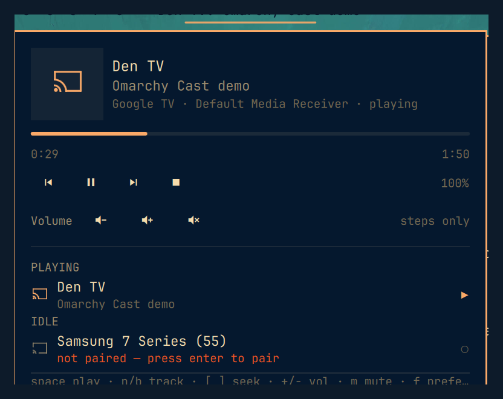

# Cast widget for Omarchy

What the TV in the other room is playing, and the controls to drive it. Finds
Chromecast, Google TV, AirPlay and Android TV devices on your network, holds a
pushed connection to each, and shows nothing at all when nothing is playing.

Built for Omarchy 4 (`shell/plugins`, `manifest.json`, `~/.config/omarchy/plugins/`).



## Install

```bash
omarchy plugin add https://github.com/meirdick/omarchy-cast.git
omarchy plugin enable meirdick.cast
omarchy bar move meirdick.cast          # optional, to place it
```

Plugins land disabled so you can read the code first. Removal is
`omarchy plugin remove meirdick.cast` — the plugin is a plain git checkout and
installs nothing outside its own directory: no hooks, no sudo, no systemd unit,
no files elsewhere on the system. Two exceptions, both created only when you
use the feature that needs them: an artwork cache under
`~/.cache/omarchy/meirdick.cast/`, and an Android TV client certificate under
`~/.local/share/omarchy/meirdick.cast/` written when you pair a device.

## Requirements

Nothing, to see your devices. Something, to control them.

With no dependencies at all the widget reads mDNS through `avahi-browse`, which
Omarchy already ships, and shows the device name and which app is running —
"Den TV — YouTube". It cannot control anything in that state and says so.

For the real thing, pick one:

```bash
# Cast only, from the official repos
sudo pacman -S python-pychromecast

# Or every backend, in a virtualenv the plugin looks for by default
python3 -m venv ~/.local/share/omarchy/meirdick.cast/venv
~/.local/share/omarchy/meirdick.cast/venv/bin/pip install \
    pychromecast pyatv androidtvremote2
```

The virtualenv is the documented path because only `pychromecast` is packaged
for Arch — `pyatv` and `androidtvremote2` are on PyPI and nowhere else. The
plugin prefers that venv when it exists and falls back to `python3` on PATH, so
either install works with no configuration. Point `pythonPath` somewhere else
if your libraries live in a different environment.

Each backend is skipped on its own when its library is missing, and the panel
says which ones are absent and why rather than leaving you to guess.

## What it talks to

| Backend | Finds | Gives you | Needs |
|---|---|---|---|
| Cast | Chromecast, Google TV, Nest, Chromecast-built-in TVs | Title, artist, album art, position, play/pause, seek, next, previous, stop | `pychromecast` |
| AirPlay | Apple TV, HomePod, AirPlay-capable TVs | Title, artist, artwork, transport, volume | `pyatv` |
| Android TV | Google TV and Android TV boxes | Volume, power, D-pad, media keys | `androidtvremote2`, one-time pairing |
| avahi | Cast devices only | Device name and running app | nothing |

Everything is local. The plugin holds no credentials, contacts no external
service, and never touches the Google Home API on port 8443 — that one needs an
account token, and this does not.

### A note on Google TV and volume

A Google TV reports `volume.controlType: "fixed"`. The TV and HDMI-CEC own the
volume, and the receiver channel silently drops any attempt to change it. The
widget honours that: the slider is hidden rather than shown doing nothing, and
the panel points you at the Android TV remote instead.

Pair it once — press enter on the unpaired device row, type the six digits the
TV shows — and volume, power and the D-pad work from the panel.

### What Cast reports on a Google TV

A Google TV wraps playback from its *native* apps in a synthetic cast session,
so you see what the TV is playing even when nobody cast anything to it. That is
the same mechanism behind the media card on an Android phone.

Those sessions frequently carry no artwork at all — a title and an artist and
nothing else. That is normal, and the panel is laid out for it rather than
leaving a hole where a cover should be.

## What the bar shows

Nothing, when nothing is playing. That is the resting state and it is
deliberate: a bar slot that is empty most of the day should not be reserved.

When something starts, one line appears: `Den TV: Chris Stapleton — Hard Livin'`,
with a glyph for playing, paused or buffering. Set `barFormat` to `compact` to
drop the device name, or `icon` to keep everything in the panel.

When several devices play at once, the bar shows the one that started most
recently. Press `f` on a device in the panel to pin the bar to it instead.

## The panel

The device under the cursor gets a card at the top: artwork, what is playing,
a seek bar you can click, transport buttons, and a volume slider when the
device accepts one. Below that, every device found, grouped into playing and
idle, with anything missing explained at the bottom.

Buttons are enabled from what the device says it supports, never from what the
protocol allows in general. A session that will not accept a skip does not
offer one.

### Keys

| Key | Does |
|---|---|
| `j` / `k`, arrows | Move the cursor |
| `space`, `enter` | Play or pause. On an unpaired device, start pairing |
| `n` / `b` | Next and previous track |
| `[` / `]` | Seek back and forward fifteen seconds |
| `+` / `-` | Volume up and down |
| `m` | Mute |
| `s` | Stop |
| `f` | Pin the bar to this device, or unpin it |
| `r` | Refresh |
| `R` | Restart the helper process |
| `g` / `G` | First and last row |
| `esc` | Close |

Mouse: left click toggles the panel, right click refreshes, middle click plays
or pauses, and the wheel changes volume.

## How it updates

It does not poll. Cast and AirPlay both push status — the receiver broadcasts a
message when a track changes, when playback pauses, when the volume moves — so
the bar reflects a change on the TV in about a second, and sits silent using
nothing in between.

That needs a persistent connection, which QML cannot hold: it has no HTTP
client, no WebSocket module, and no way to reach a protobuf-over-TLS channel.
So `bin/omarchy-cast-helper.py` runs as a resident process and speaks
newline-delimited JSON over stdin and stdout. It is plain Python source, not a
bundled binary, and it is the only subprocess the plugin starts.

The helper is declared as a plugin *service*, so the shell owns exactly one of
them. Bar widgets are built once per monitor, and a widget-owned helper would
open a second connection to every device on a two-screen desk.

## Settings

| Setting | Default | Does |
|---|---|---|
| `pythonPath` | `""` | Interpreter for the helper. Empty prefers the plugin's venv, then `python3` |
| `backends` | `cast,airplay,androidtv,avahi` | Which backends to run. Turn off ones you have installed but do not want |
| `barFormat` | `full` | `full`, `compact` or `icon` |
| `maxTitle` | `40` | Characters before the bar text is cut |
| `showDeviceName` | `true` | Prefix the bar with the device name |
| `hideWhenPaused` | `false` | Give up the bar slot the moment playback stops |
| `showGlyph` | `true` | The play/pause/buffering mark |
| `preferredDevice` | `""` | Device that keeps the bar. Set with `f` in the panel |
| `volumeStep` | `5` | Percent per scroll |
| `notifyTrack` | `false` | Desktop notification on track change |
| `helperRestartSec` | `5` | Backoff before restarting a dead helper |

## IPC

```bash
omarchy-shell meirdick.cast toggle
omarchy-shell meirdick.cast devices           # JSON, every device and its state
omarchy-shell meirdick.cast playPause "den"   # id, or any part of a device name
omarchy-shell meirdick.cast next "den"
omarchy-shell meirdick.cast volume "den" 0.4
omarchy-shell meirdick.cast pair "den" ""     # start pairing; TV shows a code
omarchy-shell meirdick.cast pair "den" 418302
omarchy-shell meirdick.cast state
omarchy-shell meirdick.cast diagnose          # what the widget believes
omarchy-shell meirdick.cast restart           # restart the helper
```

## Development

| File | Holds |
|---|---|
| `manifest.json` | The plugin contract, and every setting's default and schema |
| `Widget.qml` | The bar slot. Owns no state; reads the service through the shell |
| `Panel.qml` | The popout. A renderer plus a cursor, nothing more |
| `Service.qml` | The helper process, the device map, and the settings |
| `bin/omarchy-cast-helper.py` | Discovery and every device protocol |
| `Devices.js` | Helper JSON in, one normalized device record out |
| `Model.js` | Bar text, ranking, position extrapolation, panel rows |
| `CastMark.qml` | The icon, drawn from rectangles |

```bash
node test/model.test.js
node test/devices.test.js
python3 test/helper.test.py       # needs no backend library installed
```

Run the helper by hand to watch what the devices are actually saying — this is
by far the fastest way to debug anything:

```bash
~/.local/share/omarchy/meirdick.cast/venv/bin/python bin/omarchy-cast-helper.py
echo '{"cmd":"playPause","id":"cast:<uuid>"}' | ... # or pipe commands in
```

### Five things that will cost you an hour

- **Editing a `.js` or `.py` file does not hot-reload.** Saving under
  `~/.config/omarchy/plugins/` reloads `.qml`, because `Qt.clearComponentCache()`
  clears QML components and nothing else. Run `omarchy-restart-shell` after
  touching anything that is not QML.
- **QML load failures are silent** — the widget simply does not appear. Read the
  reason with
  `quickshell log -i "$(quickshell list --all | grep -oP 'Instance \K\w+' | head -1)" -t 100`
- **`a && b` is not a boolean.** Binding `visible: device && device.playing` to
  a bool property assigns `undefined` when `device` is null, and Qt warns and
  ignores it. Write `!!device && …`.
- **A mutated object does not re-evaluate a binding.** `Devices.apply` edits the
  state object in place, so anything derived from it needs the `revision`
  counter or an explicit assignment. This is why `ready` and `backends` are
  plain properties set in `ingest()` rather than bindings.
- **The injected `settings` object does not reliably follow `shell.json`.**
  `Service.qml` watches the file itself and prefers what it says, so a hand edit
  applies on save rather than on the next restart.

## Marketplace

Conforms to the listing requirements: public repo, `manifest.json` at the root
with all eight required fields, this README with install and removal
instructions, an MIT `LICENSE`, a root `preview.png`, a unique permanent id
outside the `omarchy.*` namespace, and `omarchy plugin validate` passing.

Category `Widgets`, tags `Bar`, `Media`, `Quickshell`.

Cast, Chromecast, Google TV and Android TV are trademarks of Google LLC;
AirPlay is a trademark of Apple Inc. This plugin is not affiliated with,
endorsed by, or supported by either. It speaks documented-by-observation local
network protocols and may stop working whenever a vendor changes them.
